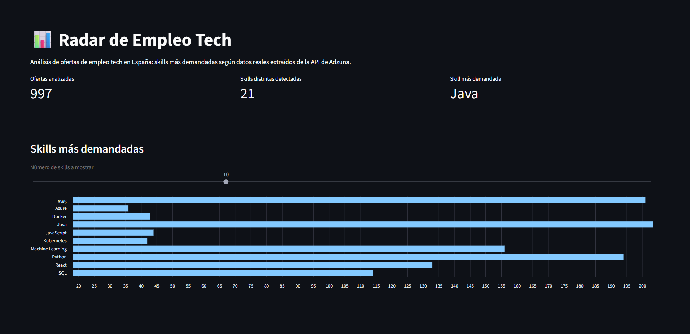
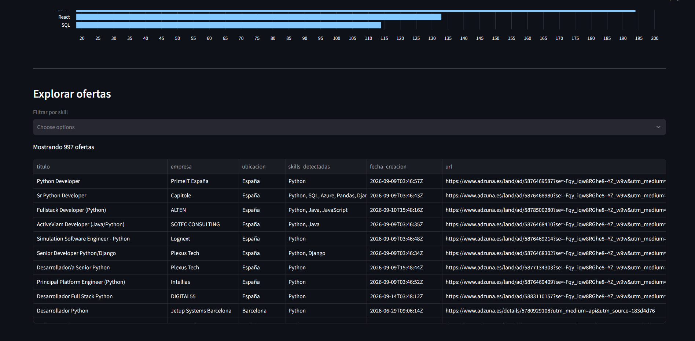

# 📊 Radar de Empleo Tech

Análisis del mercado laboral tech en España: scraping de ofertas de empleo reales, extracción automática de las skills técnicas más demandadas, y dashboard interactivo para explorar los resultados.

## Descripción

Este proyecto recopila ofertas de empleo tech a través de la API pública de [Adzuna](https://developer.adzuna.com/), detecta qué tecnologías y skills se mencionan en cada oferta mediante procesamiento de texto con Python, y presenta los resultados en un dashboard interactivo construido con Streamlit.

## Capturas




## Funcionalidades

- 🔍 **Scraping** de ofertas de empleo tech mediante la API de Adzuna, con múltiples keywords de búsqueda
- 🧠 **Detección automática de skills** (Python, Java, SQL, AWS, Docker, React, Machine Learning, entre otras) a partir del texto de las ofertas
- 📊 **Dashboard interactivo** con métricas generales, gráfico de skills más demandadas y tabla filtrable de ofertas

## Stack técnico

- **Python 3.10**
- **Requests** — llamadas a la API
- **Pandas** — procesamiento y limpieza de datos
- **Streamlit** — dashboard interactivo
- **python-dotenv** — gestión segura de credenciales

## Estructura del proyecto
radar-empleo-tech/
├── src/
│ ├── scraper.py # Recopila ofertas desde la API de Adzuna
│ ├── procesar.py # Detecta skills y genera CSVs procesados
│ └── dashboard.py # Dashboard interactivo con Streamlit
├── data/
│ ├── ofertas_tech.csv # Ofertas en bruto
│ ├── ofertas_con_skills.csv # Ofertas con skills detectadas
│ └── resumen_skills.csv # Resumen de frecuencia por skill
├── requirements.txt
└── README.md


## Instalación y uso

1. Clona el repositorio:
```bash
   git clone https://github.com/luisbasco/Radar-de-empleo-Tech.git
   cd Radar-de-empleo-Tech
```

2. Crea y activa un entorno virtual:
```bash
   python -m venv venv
   venv\Scripts\activate     # Windows
   source venv/bin/activate  # Mac/Linux
```

3. Instala las dependencias:
```bash
   pip install -r requirements.txt
```

4. Consigue tus propias credenciales gratuitas en [Adzuna Developer](https://developer.adzuna.com/) y crea un archivo `.env` en la raíz con:ADZUNA_APP_ID=tu_app_id
ADZUNA_APP_KEY=tu_app_key


5. Ejecuta el pipeline completo:
```bash
   python src/scraper.py
   python src/procesar.py
   streamlit run src/dashboard.py
```

   > Nota: los CSV ya generados están incluidos en `data/`, así que también puedes lanzar directamente `streamlit run src/dashboard.py` para ver el dashboard con los datos ya recopilados, sin necesidad de tus propias credenciales.

## Aprendizajes / retos

- Diseño de un sistema de detección de skills basado en expresiones regulares, evitando falsos positivos (p. ej. diferenciar "Java" de "JavaScript")
- Gestión segura de credenciales mediante variables de entorno
- Construcción de un dashboard interactivo y filtrable desde cero con Streamlit

## Posibles mejoras futuras

- Comparativa de salarios por skill
- Histórico temporal (evolución de demanda por skill a lo largo del tiempo)
- Clasificación automática del nivel de la oferta (junior/mid/senior) con un modelo simple de ML

## Autor

**Luis Manuel Basco García-Ballesteros**
[LinkedIn](www.linkedin.com/in/luis-manuel-basco-garcía-ballesteros-32b379327) · [GitHub](https://github.com/luisbasco)
